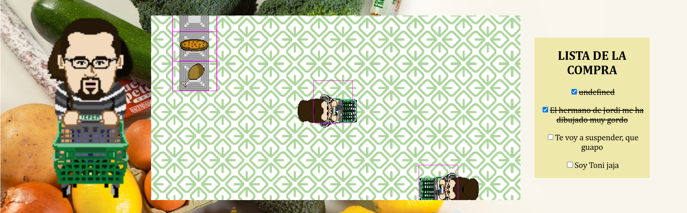
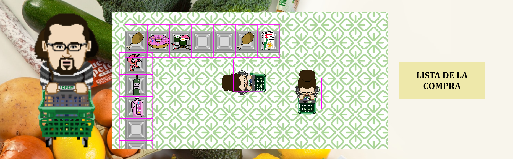

# PVLI-GRUPO13

Esto es un trabajo universitario para la asignatura de Programación de Videojuegos en Lenguajes Interpretados.

Instagram: https://www.instagram.com/rmgamesPVLI/
X (twitter): https://www.x.com/RMGamesPVLI

Descripción general:
Este proyecto trata de un videojuego hecho en Phaser. El juego trata de un juego arcade en el cuál el jugador intenta ligar con clientes de Mercadona. El jugador tendrá que descifrar qué objetos quieren los clientes de Mercadona, si se acierta, el jugador ligará con el cliente con éxito, pero si se equivoca, el jugador perderá autoestima. Al equivocarse tres veces el jugador se sentirá demasiado avergonzado y perderá. 

El jugador podrá meter ítems en el carro y chocar con los clientes, si tiene la piña en el carro intentará ligar. En caso de no tener la piña, al chocar con el cliente este dará una pista sobre los ítems que quiere. Si en el carro está el objeto de la pista, el cliente dará la siguiente pista y así hasta que el jugador tenga todos los objetos para ligar con él (son necesarios 3 objetos).  Si el jugador consigue ligar con todos los personajes del supermercado, tendrá la oportunidad de ligar con la cajera, esta requiere de tres objetos aleatorios, es decir, cambian cada ronda. 

Hay más detalles en el GDD.md

Capturas: 

Enlace a la web pública del juego: https://diegocaballeroruiz.github.io/PVLI-GRUPO13/

Assets:
Los assets de los ítems (comida) están hechas por Ian.
Los assets de los personajes (bocetos y Toni) y el logo fueron hechos por el hermano de Jordi.
El sprite del stand fue hecha por Amiel.
El logo provisional del juego fue creada en Canva por Ian.
Los otros imágenes fueron encontradas en la web.´
Los sprites creados por nosotros tienen licencia propietaria.